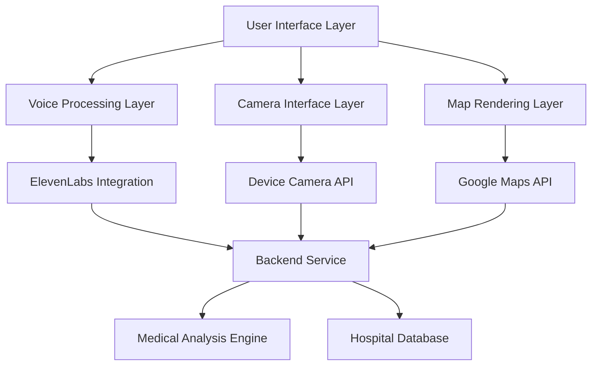

# Design Document

## Overview

FirstAidVox is a React-based frontend application built with Vite and Tailwind CSS that provides an intuitive voice-first interface for emergency medical assistance. The system integrates ElevenLabs conversational AI, camera-based visual analysis, and dynamic mapping to deliver comprehensive medical guidance through multiple interaction modalities.

The architecture follows a component-based design with clear separation between voice processing, visual interfaces, and data management. The application prioritizes real-time responsiveness and accessibility, ensuring users can receive immediate assistance during medical emergencies.

## Architecture

### High-Level Architecture



### Component Architecture

The application follows a modular React architecture with the following key layers:

1. **Presentation Layer**: React components handling UI rendering and user interactions
2. **Service Layer**: Integration services for external APIs (ElevenLabs, Google Maps, Camera)
3. **State Management Layer**: Context-based state management for voice, camera, and map data
4. **Communication Layer**: HTTP/WebSocket clients for backend integration

### Technology Stack

- **Frontend Framework**: React 18+ with Vite for fast development and building
- **Styling**: Tailwind CSS for responsive, utility-first styling
- **Voice Services**: ElevenLabs React SDK or Conversational AI WebSocket
- **Maps**: @vis.gl/react-google-maps for interactive mapping
- **State Management**: React Context API with useReducer for complex state
- **HTTP Client**: Fetch API with custom hooks for backend communication
- **Audio Processing**: Web Audio API for waveform visualization

## Components and Interfaces

### Core Components

#### VoiceAgent Component
```typescript
interface VoiceAgentProps {
  onTranscription: (text: string) => void;
  onResponse: (audioUrl: string, text: string) => void;
  isActive: boolean;
}

interface VoiceState {
  isListening: boolean;
  isProcessing: boolean;
  audioLevel: number;
  error: string | null;
}
```

#### CameraInterface Component
```typescript
interface CameraInterfaceProps {
  onPhotoCapture: (imageData: Blob) => void;
  onUploadComplete: (analysisId: string) => void;
  isEnabled: boolean;
}

interface CameraState {
  isActive: boolean;
  previewImage: string | null;
  isUploading: boolean;
  uploadProgress: number;
}
```

#### MapComponent Component
```typescript
interface MapComponentProps {
  hospitalData: HospitalLocation[];
  userLocation: Coordinates;
  isVisible: boolean;
  onDismiss: () => void;
}

interface HospitalLocation {
  id: string;
  name: string;
  coordinates: Coordinates;
  distance: number;
  emergencyServices: string[];
}
```

#### ReportCard Component
```typescript
interface ReportCardProps {
  condition: string;
  urgencyLevel: 'low' | 'moderate' | 'high';
  adviceSummary: string;
  confidence: number;
}

interface UrgencyColors {
  low: 'bg-green-100 text-green-800';
  moderate: 'bg-yellow-100 text-yellow-800';
  high: 'bg-red-100 text-red-800';
}
```

#### WaveformVisualizer Component
```typescript
interface WaveformVisualizerProps {
  audioLevel: number;
  isActive: boolean;
  variant: 'listening' | 'speaking' | 'processing';
}
```

### Service Interfaces

#### ElevenLabs Service
```typescript
interface ElevenLabsService {
  initializeConnection(): Promise<void>;
  startListening(): void;
  stopListening(): void;
  synthesizeSpeech(text: string): Promise<string>;
  onTranscription: (callback: (text: string) => void) => void;
  onAudioLevel: (callback: (level: number) => void) => void;
}
```

#### Backend Service
```typescript
interface BackendService {
  sendMessageToAgent(transcript: string, location?: Coordinates, imageFile?: Blob): Promise<AgentResponse>;
}

interface AgentResponse {
  response: string; // Text response for TTS conversion
  hospital_data?: HospitalLocation[]; // Hospital data for map display
  condition?: string; // Medical condition assessment
  urgencyLevel?: 'low' | 'moderate' | 'high'; // Urgency classification
  confidence?: number; // Assessment confidence level
}
```

## Data Models

### Application State Model
```typescript
interface AppState {
  voice: VoiceState;
  camera: CameraState;
  map: MapState;
  medical: MedicalState;
  ui: UIState;
}

interface VoiceState {
  isActive: boolean;
  isListening: boolean;
  isProcessing: boolean;
  currentTranscription: string;
  audioLevel: number;
  connectionStatus: 'connected' | 'connecting' | 'disconnected';
}

interface CameraState {
  isActive: boolean;
  hasPermission: boolean;
  previewImage: string | null;
  isUploading: boolean;
  uploadProgress: number;
  lastUploadId: string | null;
}

interface MapState {
  isVisible: boolean;
  hospitals: HospitalLocation[];
  userLocation: Coordinates | null;
  selectedHospital: string | null;
}

interface MedicalState {
  currentAssessment: MedicalResponse | null;
  conversationHistory: ConversationEntry[];
  isProcessing: boolean;
}

interface UIState {
  activePanel: 'voice' | 'camera' | 'map' | 'report';
  showBottomSheet: boolean;
  notifications: Notification[];
  theme: 'light' | 'dark';
}
```

### Backend Communication Model
```typescript
interface AgentRequest {
  text: string; // User voice transcript (required)
  latitude?: number; // User location latitude (optional)
  longitude?: number; // User location longitude (optional)
  image?: Blob; // User uploaded image file (optional)
}

interface AgentResponse {
  response: string; // AI agent response text for TTS
  hospital_data?: HospitalLocation[]; // Hospital data if location services needed
  condition?: string; // Medical condition assessment
  urgencyLevel?: 'low' | 'moderate' | 'high'; // Urgency classification
  confidence?: number; // Assessment confidence level
}
```

### Location Model
```typescript
interface Coordinates {
  latitude: number;
  longitude: number;
  accuracy?: number;
}

interface HospitalLocation {
  id: string;
  name: string;
  coordinates: Coordinates;
  address: string;
  phone: string;
  distance: number;
  emergencyServices: EmergencyService[];
  rating: number;
  isOpen24Hours: boolean;
}

interface EmergencyService {
  type: 'emergency_room' | 'urgent_care' | 'trauma_center';
  waitTime: number;
  availability: 'available' | 'busy' | 'full';
}
```

## Correctness Properties

*A property is a characteristic or behavior that should hold true across all valid executions of a system-essentially, a formal statement about what the system should do. Properties serve as the bridge between human-readable specifications and machine-verifiable correctness guarantees.*
Based on the prework analysis, I'll now define the key correctness properties that must hold for the FirstAidVox system:

**Property 1: Voice activation consistency**
*For any* user interface state, clicking the start button should result in the Voice_Agent activating the microphone and setting the listening state to true
**Validates: Requirements 1.1**

**Property 2: STT conversion reliability**
*For any* valid audio input, the Voice_Agent should convert the audio to text through the STT service
**Validates: Requirements 1.2**

**Property 3: Backend communication integrity**
*For any* processed text from voice input, the Voice_Agent should send the text to the Backend_Service medical analysis endpoint
**Validates: Requirements 1.3**

**Property 4: TTS response processing**
*For any* text response received from the Backend_Service, the Voice_Agent should convert it to audio output using TTS
**Validates: Requirements 1.4**

**Property 5: Waveform visualization synchronization**
*For any* audio level change while the Voice_Agent is active, the Waveform_Visualizer should update to reflect the current audio activity
**Validates: Requirements 1.5**

**Property 6: Camera activation consistency**
*For any* application state, clicking the camera icon should result in the Camera_Interface activating the device camera
**Validates: Requirements 2.1**

**Property 7: Photo preview display**
*For any* captured photo, the Camera_Interface should display a preview of the image for user confirmation
**Validates: Requirements 2.2**

**Property 8: Photo upload integration**
*For any* confirmed photo, the Camera_Interface should upload the image to the Backend_Service analyze endpoint and integrate it with the current conversation
**Validates: Requirements 2.3, 2.4**

**Property 9: Upload error handling**
*For any* failed photo upload, the Camera_Interface should display an error message and provide retry capability
**Validates: Requirements 2.5**

**Property 10: Conditional map display**
*For any* Backend_Service response containing hospital_data, the Map_Component should slide up and display with hospital markers
**Validates: Requirements 3.1, 3.2**

**Property 11: Hospital marker information completeness**
*For any* displayed hospital marker, the Map_Component should show all relevant facility information including name, distance, and services
**Validates: Requirements 3.3**

**Property 12: Map interactivity preservation**
*For any* visible Map_Component, user interactions for zooming and panning should remain functional
**Validates: Requirements 3.4**

**Property 13: Map dismissal behavior**
*For any* user dismissal action, the Map_Component should slide down and hide from view
**Validates: Requirements 3.5**

**Property 14: Medical report display completeness**
*For any* completed medical analysis, the Report_Card should display the predicted condition, color-coded urgency level, and advice summary
**Validates: Requirements 4.1, 4.2, 4.3**

**Property 15: Real-time report updates**
*For any* new medical data processed, the Report_Card should update the displayed information immediately
**Validates: Requirements 4.4**

**Property 16: System responsiveness guarantee**
*For any* user action initiated, the system should provide visual feedback within 100 milliseconds
**Validates: Requirements 5.1**

**Property 17: Loading state consistency**
*For any* data upload or processing operation, the system should display appropriate loading states
**Validates: Requirements 5.3**

**Property 18: Simultaneous response updates**
*For any* Backend_Service response received, the system should update both audio output and visual components simultaneously
**Validates: Requirements 5.4**

**Property 19: Service error handling**
*For any* service that becomes unavailable, the system should display clear error messages and suggest alternative actions
**Validates: Requirements 5.5**

**Property 20: Voice service initialization**
*For any* application startup, the Voice_Agent should successfully establish connection with ElevenLabs services
**Validates: Requirements 6.1**

**Property 21: Voice service error recovery**
*For any* voice service error encountered, the Voice_Agent should implement fallback mechanisms and attempt recovery
**Validates: Requirements 6.3**

**Property 22: Voice request queuing**
*For any* multiple voice requests made simultaneously, the Voice_Agent should handle request queuing and prevent audio conflicts
**Validates: Requirements 6.4**

**Property 23: Connection monitoring and recovery**
*For any* connection issue while voice services are active, the Voice_Agent should monitor status and reconnect if necessary
**Validates: Requirements 6.5**

**Property 24: Responsive interface rendering**
*For any* device type, the application should render a responsive interface using Tailwind CSS
**Validates: Requirements 7.1**

**Property 25: Mobile camera integration**
*For any* mobile device access, the Camera_Interface should utilize device-specific camera capabilities
**Validates: Requirements 7.2**

**Property 26: Responsive layout adaptation**
*For any* screen size, the Map_Component and Report_Card should adjust layout appropriately
**Validates: Requirements 7.3**

**Property 27: Input event consistency**
*For any* touch or click interaction, the system should respond consistently regardless of input method
**Validates: Requirements 7.4**

**Property 28: Cross-device functionality preservation**
*For any* device type, all system functionality should be preserved while maintaining responsiveness
**Validates: Requirements 7.5**

## Error Handling

### Voice Service Error Handling
- **Connection Failures**: Implement exponential backoff retry mechanism with maximum 3 attempts
- **Audio Processing Errors**: Provide fallback to text input when voice services fail
- **STT/TTS Failures**: Display clear error messages and offer manual text alternatives
- **Timeout Handling**: Set 30-second timeout for voice processing with user notification

### Camera Interface Error Handling
- **Permission Denied**: Guide user through permission granting process with clear instructions
- **Camera Unavailable**: Provide alternative text description input method
- **Upload Failures**: Implement retry mechanism with progress indication and error details
- **Image Processing Errors**: Validate image format and size before upload attempts

### Map Component Error Handling
- **Location Services Disabled**: Request permission and provide manual location entry
- **Google Maps API Failures**: Display static hospital list as fallback
- **Network Connectivity Issues**: Cache last known hospital data for offline access
- **Invalid Hospital Data**: Validate and sanitize hospital information before display

### Backend Service Error Handling
- **API Unavailability**: Implement circuit breaker pattern with graceful degradation
- **Response Timeout**: Set 15-second timeout with retry mechanism
- **Invalid Response Format**: Validate response structure and provide default values
- **Rate Limiting**: Implement request queuing with user feedback on wait times

### General Error Handling Principles
- **User-Friendly Messages**: All error messages should be clear, actionable, and non-technical
- **Graceful Degradation**: System should remain functional even when some services fail
- **Error Recovery**: Provide clear paths for users to recover from error states
- **Logging and Monitoring**: Comprehensive error logging for debugging and improvement

## Testing Strategy

### Dual Testing Approach

The FirstAidVox application requires both unit testing and property-based testing to ensure comprehensive coverage and reliability:

**Unit Testing Approach:**
- Unit tests verify specific examples, edge cases, and error conditions
- Focus on component integration points and user interaction flows
- Test specific scenarios like successful voice activation, photo upload completion, and map display
- Validate error handling paths and recovery mechanisms
- Test responsive design breakpoints and device-specific functionality

**Property-Based Testing Approach:**
- Property tests verify universal properties that should hold across all inputs
- Use **fast-check** library for JavaScript/TypeScript property-based testing
- Configure each property-based test to run a minimum of 100 iterations
- Each property-based test must be tagged with a comment referencing the design document property
- Tag format: **Feature: first-aid-voice-ui, Property {number}: {property_text}**

**Property-Based Testing Library:**
The system will use **fast-check** as the property-based testing library for JavaScript/TypeScript. This library provides:
- Comprehensive generators for various data types
- Shrinking capabilities to find minimal failing examples
- Integration with popular testing frameworks like Jest and Vitest
- Support for async property testing for API interactions

**Testing Requirements:**
- Each correctness property must be implemented by a single property-based test
- Property-based tests must run a minimum of 100 iterations to ensure statistical confidence
- All property-based tests must include explicit comments linking to design document properties
- Unit tests and property tests are complementary and both must be included in the test suite

**Test Coverage Areas:**
- Voice interaction workflows and state management
- Camera capture, preview, and upload functionality
- Map display logic and hospital data rendering
- Medical report generation and display
- Error handling and recovery mechanisms
- Cross-device compatibility and responsive behavior
- Backend service integration and data validation

**Testing Infrastructure:**
- Use Vitest as the primary testing framework for fast execution
- Implement React Testing Library for component testing
- Set up MSW (Mock Service Worker) for API mocking during tests
- Configure test environment to simulate different device types and screen sizes
- Implement custom test utilities for voice and camera simulation